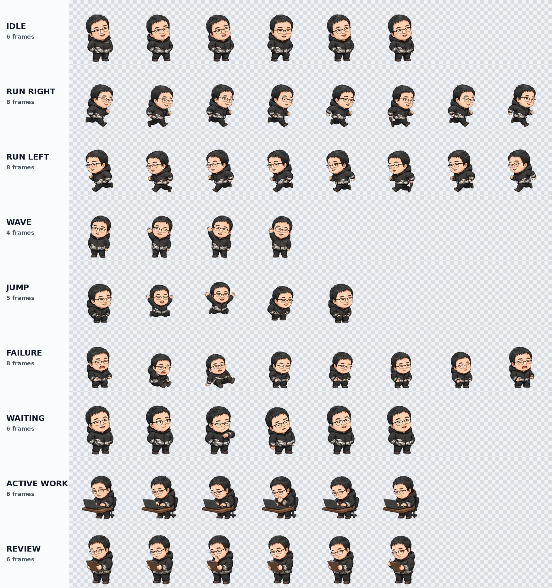

# LYH Codex Pet

以刘雨航为原型制作的 ChatGPT Work / Codex 动画桌宠。形象保留了短黑发、黑框眼镜、圆脸和黑色羽绒服等辨识特征。

> 本项目公开发布已获得原型人物刘雨航本人同意。原始照片不包含在仓库中。



## 安装

### ChatGPT / Codex 桌面应用

打开项目的 GitHub Pages 页面，点击 **安装刘雨航桌宠**。该按钮会通过 `codex://pets/install` 唤起桌面应用的安装流程。

也可以下载 [`assets/lyh_codex_pet.webp`](assets/lyh_codex_pet.webp)，然后在 **Settings > Pets > Upload pet** 中手动上传。

### Codex CLI

安装后，在支持图像显示的终端中输入：

```text
/pets
```

从列表中选择“刘雨航”。终端桌宠需要 Kitty Graphics、Sixel 或 iTerm2 3.6+，并且不支持 tmux 与 Zellij。

## 动作状态

| 行 | 状态 | 帧数 |
| --- | --- | ---: |
| 1 | Idle | 6 |
| 2 | Run right | 8 |
| 3 | Run left | 8 |
| 4 | Wave | 4 |
| 5 | Jump | 5 |
| 6 | Failure | 8 |
| 7 | Waiting | 6 |
| 8 | Active work | 6 |
| 9 | Review | 6 |

成品采用透明 WebP，尺寸为 `1536 × 1872`，由 `8 × 9` 个 `192 × 208` 单元格组成。

## 许可证

- 仓库中的代码与网页：MIT License，见 [`LICENSE`](LICENSE)。
- 刘雨航桌宠形象与图像素材：CC BY-NC 4.0，见 [`ASSET_LICENSE.md`](ASSET_LICENSE.md)。

